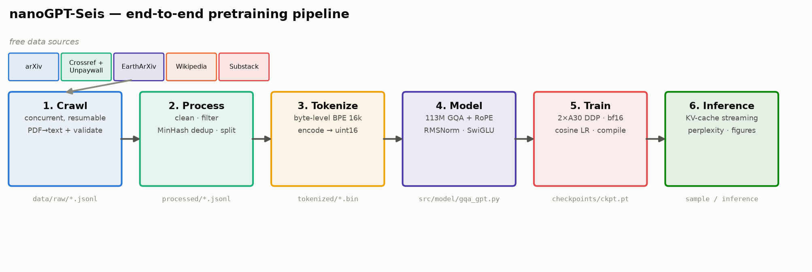
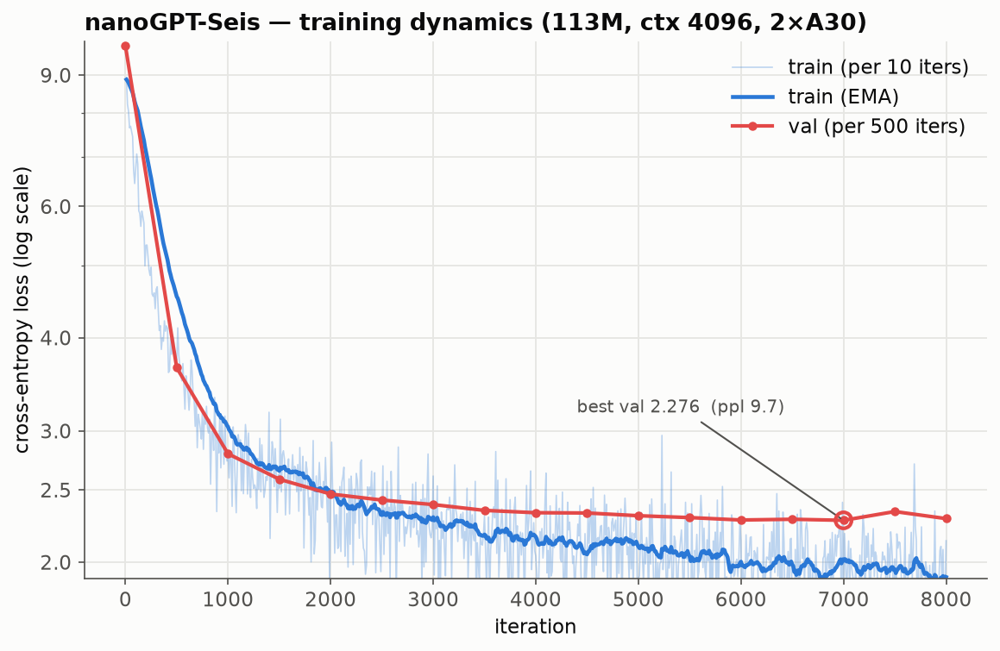
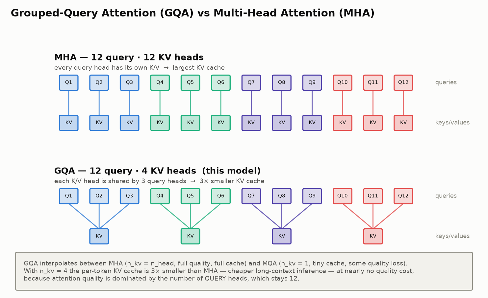

<div align="center">

# 🌍 nanoGPT-Seis

[English](README.md) | [中文](README.zh-CN.md)

**从零训练一个面向地震科学的小型 GPT：从空文件夹到可推理模型，把完整 LLM 预训练生命周期逐块讲清楚。**

采集 → 清洗 → 分词 → 建模 → 训练 → 推理，运行在 2× NVIDIA A30（48 GB）上。

</div>



<p align="center">六类免费数据源 → 爬取 → 清洗/去重 → 16k BPE →
113M GQA+RoPE decoder → 2-GPU DDP 训练 → 流式推理。每个阶段都在下文展开。</p>

---

nanoGPT-Seis 是一个教学型代码库。它不是为了直接做出最强的地震大模型，而是为了把
预训练语言模型的每一个环节讲清楚：数据从哪里来，如何清洗和去重，tokenizer 如何
训练，Transformer 为什么这样设计，如何用两张 GPU 做分布式训练，以及如何做推理服务。
README 中的困惑度、显存、token 数、训练速度等指标都来自实际实验。

语料混合了地震/地震学文本和通用英文文本。领域数据包括通过 Crossref+Unpaywall
获取的开放论文、arXiv/EarthArXiv 预印本、地震相关 Wikipedia 页面以及
“Earthquake Insights” Substack；通用数据包括 Wikipedia 和 FineWeb-Edu，用来改善
普通语言表达能力。总体约为 24% 领域文本 / 76% 通用文本。这样一个聚焦语料让约
100M 参数的模型可以在单节点上完成完整闭环：一天内看到数据、训练曲线、推理效果和
失败模式，而不是只停留在抽象概念。

> **状态：**预训练生命周期已完成，包括数据采集、清洗、tokenizer、训练和推理。

## 目录

1. [结果概览](#1-结果概览)
2. [快速开始](#2-快速开始)
3. [阶段 1：数据采集](#3-阶段-1数据采集)
4. [阶段 2：清洗与去重](#4-阶段-2清洗与去重)
5. [阶段 3：BPE tokenizer](#5-阶段-3bpe-tokenizer)
6. [阶段 4：模型结构](#6-阶段-4模型结构)
7. [阶段 5：训练](#7-阶段-5训练)
8. [阶段 6：推理](#8-阶段-6推理)
9. [代码结构](#9-代码结构)
10. [Scaling-law 实验](#10-scaling-law-实验)

---

## 1. 结果概览

| 项目 | 数值 |
|---|---|
| 语料 | 533,248 篇文档 · 485.7M words · **822.7M 训练 tokens**（约 2.4:1 通用:领域） |
| 模型 | **113M** 参数，decoder-only，GQA + RoPE + RMSNorm + SwiGLU |
| 硬件 | 2× NVIDIA A30（每张 24 GB），bf16，DDP；也可在单张 RTX 3090/4090 上运行，或通过减小 batch 在 12-16 GB 显存上运行 |
| 上下文长度 | **4096** tokens |
| 训练 | 8,000 iters，约 3.8 epochs，约 6.5 小时，约 2.9 s/iter |
| 通用文本 fluency | **0.997 bits/byte**；相比 domain-only base 的 1.527 降低约 35% |
| 推理 | KV-cache 流式生成，首 token 延迟约 176 ms，带 anti-repeat sampler |

<p align="center"></p>

三个值得停下来看一眼的结论：

- **更长上下文有帮助。** 在数据保持一致的对比实验中，把 context length 从 1024
  增加到 4096，将 domain-only 模型的 perplexity 从 10.93 降到 9.74，下降约 11%，
  而每步计算成本只增加约 26%。论文文本有长距离结构，1024 token 经常看不完整。
- **模型确实会利用长上下文。** 在 4096-token 窗口内，位置 2048-4096 的 token loss
  比位置 0-64 低约 25%，说明模型在利用前面几千个 token，而不是只看局部。
- **加入通用文本显著恢复普通英文流畅度。** 加入 Wikipedia + FineWeb-Edu 后，通用
  文本 bits/byte 相比纯论文模型降低约 35%，但领域 sharpness 有一定损失。这是
  fluency 与 specialization 的典型权衡。

### 数据混合：domain-only v1 → general + domain v2

纯论文模型能写出论文腔，但在普通英文上容易重复、僵硬甚至失真。v2 加入约 540M
tokens 的 Wikipedia + FineWeb-Edu，使总训练 token 达到约 823M，训练约 3.8 epochs。
这个重复次数仍在数据受限语言模型常见的可接受范围内：数据被重复几轮，但还没有到
明显纯记忆化的程度。

<p align="center"></p>

这里使用 bits-per-byte 做比较，因为它与 tokenizer 无关，因此 v1 和 v2 可以公平
对比。代码见 `src/compare_models.py`。

<p align="center"></p>

v2 在通用 prose 上明显更流畅，生成非地震文本时也更连贯；代价是地震论文文本上的
bits/byte 变差一些。这个结果也说明：base pretraining 只给出一个语言建模基础，并不会
自动变成 chat assistant。后续如果要做问答或助手能力，应该以这个更流畅的 base 作为
SFT 起点。domain-only 权重保留为 `checkpoints/ckpt_v1_domain.pt`。

---

## 2. 快速开始

### 2.1 直接试用预训练模型

预训练的 113M checkpoint 托管在 Hugging Face Hub：
[`jiazhe868/nanogpt_seis`](https://huggingface.co/jiazhe868/nanogpt_seis)。

```bash
# 环境：需要可用的 CUDA-12.4 PyTorch，见下方说明
conda activate nanogpt_seis
pip install -r requirements.txt

# 下载 checkpoint、tokenizer 和配置文件到 src/inference.py 默认寻找的位置
huggingface-cli download jiazhe868/nanogpt_seis \
    checkpoints/ckpt.pt \
    data/tokenized/tokenizer.json \
    data/tokenized/meta.json \
    configs/gpt120m_ctx4k.yaml \
    --local-dir .

python -m src.inference --prompt "The 2011 Tohoku earthquake"
```

### 2.2 从零复现预训练流程

```bash
# 环境
conda activate nanogpt_seis
pip install -r requirements.txt

# 地震领域数据源
python -m src.crawl.wikipedia        --max-pages 500                              # earthquake 标题页面
python -m src.crawl.fulltext         --per-journal 3000 --broad 30000 --workers 64
python -m src.crawl.preprints        --arxiv 3000 --eartharxiv 2000
python -m src.crawl.substack         --max 500

# 通用文本混合，用于提升普通语言流畅度
python -m src.crawl.general          --wiki-tokens 300000000 --fineweb-tokens 240000000

python -m src.process.build_corpus   --val-frac 0.005      # 清洗 · 去重 · 切分
python -m src.tokenizer.train_bpe    --vocab-size 16384    # 训练 tokenizer
python -m src.tokenizer.encode                             # 写出 uint16 shards

torchrun --standalone --nproc_per_node=2 \
    -m src.train --config configs/gpt120m_ctx4k.yaml       # 两张 GPU 训练

python -m src.inference --prompt "The 2011 Tohoku earthquake"   # 流式生成
```

> **环境提醒。** 如果 PyTorch 的 CUDA 版本高于驱动支持，`torch.cuda.is_available()`
> 可能返回 `False` 并退回 CPU。请先运行：
>
> ```bash
> python -c "import torch; print(torch.cuda.is_available())"
> ```
>
> 必须输出 `True`。本项目使用 `torch 2.6.0+cu124` 匹配 CUDA-12.5 驱动。

---

## 3. 阶段 1：数据采集

**目标：**从合法、免费、可复现的数据源构建地震科学语料。代码位于 `src/crawl/`。

### 3.1 数据源和获取方式

| 数据源 | 模块 | 内容 | 方式 |
|---|---|---|---|
| 研究论文 | `fulltext.py` | 开放获取的地震论文全文 PDF | Crossref DOI → Unpaywall OA PDF → 下载 → 抽取文本 |
| 预印本 | `preprints.py` | arXiv + EarthArXiv 全文 | arXiv API + OSF/DOI → PDF |
| Wikipedia | `wikipedia.py` | 标题包含 earthquake 的页面 | MediaWiki API 文本抽取 |
| Substack | `substack.py` | Earthquake Insights 文章 | archive API + HTML 解析 |
| 通用文本 | `general.py` | Wikipedia + FineWeb-Edu | Hugging Face `datasets` streaming 到指定 token budget |

**为什么要加入通用文本？** 约 113M 参数的模型如果只训练论文，会很快学会论文式表达，
但普通英文会变得重复、僵硬、不自然。原始 domain-only 语料也远低于 compute-optimal
训练量。因此项目加入 Wikipedia 和 FineWeb-Edu：前者提供百科式说明，后者提供质量过滤
后的教育类 web 文本。这个 fluent base 更适合作为后续 SFT 的起点。

每个文档最终都会被标准化为统一 schema（`src/crawl/common.py`）：

```python
@dataclass
class Doc:
    source: str          # "fulltext" | "arxiv" | "wikipedia" | ...
    id: str              # 每个 source 内稳定的 id，用于去重和恢复
    title: str
    text: str            # 清洗后用于 tokenize 的正文
    url: str = ""
    date: str = ""
    extra: dict = field(default_factory=dict)
```

### 3.2 Web crawling 具体怎么做

**找论文：Crossref。** Crossref 索引了大规模学术元数据，而且 REST API 免费、稳定。
项目按 journal ISSN 和关键词翻页查找 earthquake 相关 journal articles。深翻页使用
cursor，而不是 offset，避免 offset 上限。

```python
params = {
    "rows": 1000,
    "cursor": cursor,
    "filter": "type:journal-article,issn:0094-8276",
    "query.bibliographic": "earthquake",
    "mailto": EMAIL,
}
```

**找开放 PDF：Unpaywall。** DOI 并不等于 PDF。Unpaywall 会把 DOI 映射到合法开放
副本。代码优先尝试 repository/green OA 地址，因为 publisher 页面经常是反爬页面、
landing page 或需要脚本渲染的 stub。

```python
# repository copies 通常比 publisher links 更可靠
prio = 0 if loc.get("host_type") == "repository" else 1
```

**并发下载，但按 host 节流。** PDF 来自很多不同服务器。全局单线程太慢，但对同一个
host 并发太多又不礼貌。项目使用线程池，同时为每个 host 加锁和限速：不同 host 可以
并发，同一个 host 串行并间隔访问。

```python
class HostThrottle:
    def wait(self, host):
        with self._guard:
            host_lock = self._locks.setdefault(host, threading.Lock())
            self._last.setdefault(host, 0.0)
        with host_lock:
            delta = self.min - (time.monotonic() - self._last[host])
            if delta > 0:
                time.sleep(delta)
            self._last[host] = time.monotonic()
```

**验证每个下载。** 很多 “OA PDF” 实际是 HTML、反爬页面、5KB stub 或封面页。代码只
接受真正的 PDF，并且要求页数和抽取文本长度达到阈值。

```python
if not pdf_bytes.startswith(b"%PDF"): return None   # HTML / stub
if doc.page_count < 2:                return None   # 只有封面页
if len(text) < min_chars:             return None   # 抽取文本太少
```

**避免浪费 API budget。** 有些期刊几乎全是 paywalled。扫描几千条 DOI 只会消耗
Unpaywall 请求额度。代码里有 low-yield abort gate：如果某个 journal 在足够样本后命中率
持续过低，就提前停止。

**为什么从 OpenAlex 换到 Crossref + Unpaywall？** 项目早期尝试过 OpenAlex，但构建期间
OpenAlex 的免费访问策略发生变化，免费请求额度很快耗尽。Crossref + Unpaywall 是更稳的
免费替代。这个经历也直接影响了代码设计：数据源假设要写清楚，爬虫必须可恢复。

### 3.3 通用模式：线程安全 BFS crawler

上面的论文爬虫是 API 驱动的，但底层模式是经典的并发 BFS：维护一个 frontier 队列和
一个 seen 集合，多个 worker 从队列取任务、下载、解析、扩展新链接。并发 crawler 的难点
不在 HTTP，而在共享状态。

三个规则让它正确：

- frontier 用 `queue.Queue`，它内部同步，`get()` / `put()` 是原子的，且 `get()` 可以阻塞。
- seen-set 必须单独加锁。“这个 URL 是否新？如果新就加入 seen 并 enqueue” 是一个
  read-modify-write；不加锁会让两个线程同时认为同一 URL 是新的。
- 结束条件用 `Queue.join()` / `task_done()`。并发 BFS 中，某个瞬间队列为空不代表整个
  crawl 结束，因为另一个 worker 可能马上 enqueue 新链接。`join()` 会等待所有已入队任务
  都被完整处理。

```python
import re, threading, queue, requests
from urllib.parse import urljoin, urldefrag, urlparse

class BFSCrawler:
    """Breadth-first web crawler: one shared frontier, N worker threads."""

    def __init__(self, seeds, max_pages=5000, n_workers=16, min_interval=1.0):
        self.frontier   = queue.Queue()
        self.seen       = set(seeds)
        self.seen_lock  = threading.Lock()
        self.pages      = []
        self.pages_lock = threading.Lock()
        self.max_pages  = max_pages
        self.n_workers  = n_workers
        self.throttle   = HostThrottle(min_interval)
        for s in seeds:
            self.frontier.put((s, 0))

    def _links(self, base, html):
        for m in re.finditer(r'href=["\'](.*?)["\']', html):
            url, _ = urldefrag(urljoin(base, m.group(1)))
            if url.startswith(("http://", "https://")):
                yield url

    def _enqueue(self, url, depth):
        with self.seen_lock:
            if url in self.seen:
                return
            self.seen.add(url)
        self.frontier.put((url, depth))

    def _worker(self):
        while True:
            url, depth = self.frontier.get()
            if url is None:
                self.frontier.task_done()
                return
            try:
                with self.pages_lock:
                    if len(self.pages) >= self.max_pages:
                        continue
                self.throttle.wait(urlparse(url).netloc)
                html = requests.get(url, timeout=10).text
                with self.pages_lock:
                    if len(self.pages) >= self.max_pages:
                        continue
                    self.pages.append((url, html))
                for link in self._links(url, html):
                    self._enqueue(link, depth + 1)
            except Exception:
                pass
            finally:
                self.frontier.task_done()

    def run(self):
        workers = [threading.Thread(target=self._worker, daemon=True)
                   for _ in range(self.n_workers)]
        for t in workers:
            t.start()
        self.frontier.join()
        for _ in workers:
            self.frontier.put((None, 0))
        for t in workers:
            t.join()
        return self.pages
```

本项目的 `fulltext.py` 可以看作这个 skeleton 的一跳特化：frontier 是 Crossref 返回的
DOI 列表，扩展动作不是提取 `<a href>`，而是查询 Unpaywall PDF locations；共享状态不是
URL seen-set，而是已处理文档 id 的 resume-set。线程池和 per-host throttle 的思想相同。

---

## 4. 阶段 2：清洗与去重

代码位于 `src/process/`。这一阶段决定了模型看到的“世界”是什么样子。小模型尤其容易被
脏数据、重复数据和 boilerplate 带偏，因此清洗和去重不是附属环节，而是训练质量的一部分。

### 4.1 Source-aware cleaning：`clean.py`

PDF、Wikipedia、Substack 和 web text 的噪声不同。统一清洗包括：

- Unicode 规范化和控制字符清理。
- 空白字符归一，把多余空行、tab、不可见字符整理成稳定格式。
- PDF 断词修复，例如 `earth-\nquake → earthquake`。
- 页眉页脚、引用页码、下载提示等常见 boilerplate 过滤。
- 参考文献截断：论文末尾的 references/bibliography 常常占很大篇幅，但对训练语言模型
  价值较低，还会引入大量重复 citation 模式。

source-aware 的意思是：不要用同一个正则粗暴处理所有数据。PDF 需要 de-hyphenation，
Wikipedia 需要处理 section 和 markup，Substack 需要 HTML body parse，FineWeb-Edu 则
主要依赖上游质量过滤。

### 4.2 质量过滤

质量过滤不是追求完美，而是剔除明显有害样本。典型规则包括：

- 文本太短直接丢弃。
- 可见字符比例太低、重复行太多、乱码比例过高时丢弃。
- 对 PDF 抽取失败的页面或只有封面的 stub 丢弃。
- 对明显不是正文的网页、目录页、版权页、下载页做过滤。

这些规则让训练 token budget 更多花在真正的正文上。

### 4.3 Deduplication：`dedup.py`

去重分两层：

1. **精确去重。** 对标准化文本或稳定 id 做 hash，相同文本只保留一次。
2. **近重复去重。** 用 MinHash/LSH 检测高度相似文档，例如同一论文的多个镜像、副本、
   arXiv 和 journal 版本、网页转载等。

MinHash 的核心直觉：把文档切成 shingles，例如连续 5 个词为一组。两个文档越相似，
它们 shingle 集合的 Jaccard 相似度越高。MinHash 用随机 hash 的最小值签名近似这个
Jaccard，相比完整两两比较便宜得多。

```python
# 粗略示意：真实代码中会处理 tokenization、hash family 和 LSH buckets
def shingles(words, k=5):
    return {" ".join(words[i:i+k]) for i in range(len(words) - k + 1)}

def jaccard(a, b):
    return len(a & b) / max(1, len(a | b))
```

为什么要近重复去重？

- 重复数据会让验证 loss 虚低，因为 val 可能包含 train 的近副本。
- 小模型会被重复 boilerplate 强烈影响，生成时更容易复读。
- 论文语料天然有重复：preprint、accepted version、publisher version、repository copy。

最终 `build_corpus.py` 会写出 train/val split 和统计文件。大体流程是：

```bash
python -m src.process.build_corpus --val-frac 0.005
```

`data/processed/*.jsonl` 默认不提交到 GitHub；用户可以通过爬虫重新生成。

---

## 5. 阶段 3：BPE tokenizer

代码位于 `src/tokenizer/`。本项目使用 byte-level BPE，词表大小 16,384。

### 5.1 为什么用 byte-level BPE

语言模型不直接看字符或词，而是看 token。tokenizer 的选择会影响：

- 序列长度：token 越碎，同一文本需要越多位置。
- OOV 行为：遇到生僻词、公式、地名、震级符号时是否稳定。
- 词表大小：embedding 和 LM head 参数量随 vocab size 增长。
- domain terms：`subduction`, `hypocenter`, `Mw`, `aftershock` 等词是否被合理切分。

byte-level BPE 的优势是没有真正的 OOV：任何文本都可以退回 byte 表示。相比 word-level
tokenizer，它对罕见地名、符号、拼写变体和科学文本更稳。相比纯 byte/char，它又能把常见
片段合并成较长 token，降低上下文长度压力。

### 5.2 BPE 如何工作

BPE 的基本算法很简单：

1. 初始时把文本切成最小单位，byte-level BPE 以 byte/byte-like symbols 起步。
2. 统计相邻 symbol pair 的频率。
3. 找出出现最频繁的 pair，把它合并成一个新 symbol。
4. 重复直到达到目标词表大小。

一个玩具例子：

```text
low lower lowest
```

如果 `l o` 经常相邻，就合并成 `lo`；如果 `lo w` 经常相邻，就合并成 `low`；继续合并后，
常见词会变成短 token 序列，罕见词则拆成多个 subword。

项目使用 Hugging Face `tokenizers` 实现 byte-level BPE：

```python
tokenizer = Tokenizer(BPE(unk_token=None))
tokenizer.pre_tokenizer = ByteLevel(add_prefix_space=False)
tokenizer.decoder = ByteLevelDecoder()
trainer = BpeTrainer(vocab_size=args.vocab_size, special_tokens=[EOT])
tokenizer.train_from_iterator(_iter_texts(args.train), trainer=trainer)
tokenizer.save(str(args.out))
```

训练命令：

```bash
python -m src.tokenizer.train_bpe --vocab-size 16384
```

### 5.3 编码为 `uint16` shards

词表大小是 16,384，小于 65,536，因此 token id 可以用 `uint16` 存储。相比 `int32`，
磁盘占用减半，训练时 mmap 或顺序读也更轻。

```bash
python -m src.tokenizer.encode
```

输出包括：

- `data/tokenized/tokenizer.json`
- `data/tokenized/meta.json`
- train/val token shards

预训练模型对应的 `tokenizer.json` 和 `meta.json` 已托管在 Hugging Face Hub。

---

## 6. 阶段 4：模型结构

模型代码位于 `src/model/gqa_gpt.py`。它是一个 Llama-style decoder-only GPT：

| 项目 | 数值 |
|---|---|
| vocab size | 16,384 |
| context length | 4096 |
| layers | 16 |
| d_model | 768 |
| query heads | 12 |
| KV heads | 4 |
| attention | GQA |
| position | RoPE |
| norm | RMSNorm |
| MLP | SwiGLU |
| dropout | 0.0 |

### 6.1 为什么选择这些组件

| 组件 | 传统选择 | 本项目选择 | 原因 |
|---|---|---|---|
| 位置编码 | learned absolute PE | RoPE | 更适合长上下文，Llama 系列常用 |
| Attention | full MHA | GQA | KV cache 更小，推理更省显存 |
| Norm | LayerNorm | RMSNorm | 计算更轻，现代 decoder 常用 |
| MLP | GELU MLP | SwiGLU | Llama/T5 风格 gated FFN，表达能力更强 |
| 架构 | post-norm | pre-norm | 训练更稳定 |
| embedding | untied | tied input/output | 减少参数，改善 LM head 共享 |

### 6.2 Attention：queries, keys, values

自注意力回答的是：当前位置生成下一个 token 时，应该从前面哪些 token 取信息？

每个 token 的 hidden state 会投影成三组向量：

- query：当前位置“想找什么”。
- key：每个历史位置“提供什么索引”。
- value：每个历史位置“真正提供什么内容”。

注意力分数是 query 和 key 的点积：

```text
score(i, j) = q_i · k_j / sqrt(head_dim)
```

decoder-only 模型必须使用 causal mask，保证位置 `i` 只能看 `j <= i` 的 token，不能偷看
未来。PyTorch 的 SDPA/FlashAttention 会在 GPU 上高效实现这个过程。

### 6.3 RoPE：Rotary Position Embeddings

传统 learned absolute position embedding 是给每个位置加一个向量。RoPE 不直接“加位置”，
而是在 query/key 的二维子空间里按位置旋转。位置越远，query/key 的相对相位差越大。

RoPE 的关键性质是：attention 分数自然包含相对位置信息。对于长上下文，这比简单 learned
absolute embedding 更灵活，也更接近 Llama 系列设计。

<p align="center"></p>

### 6.4 GQA：Grouped-Query Attention

标准 multi-head attention 中，每个 query head 都有自己的 key/value head。推理时每生成
一个 token，都要把每层每个 head 的 key/value 存进 KV cache。context 越长，KV cache 越大。

GQA 的做法是：query heads 保持较多，但多个 query heads 共享较少的 KV heads。本项目是
12 个 query heads、4 个 KV heads，相当于每 3 个 query heads 共享一组 key/value。

这样做的好处：

- 训练质量接近 full MHA。
- 推理 KV cache 约减少到 1/3。
- 长上下文 streaming inference 更省显存。

<p align="center"></p>

### 6.5 RMSNorm，以及 pre-norm vs post-norm

LayerNorm 会减均值、除标准差；RMSNorm 只按 root mean square 缩放，不减均值。它更简单、
更快，在很多现代 decoder-only 模型里效果足够好。

本项目使用 pre-norm：

```text
x = x + Attention(RMSNorm(x))
x = x + MLP(RMSNorm(x))
```

pre-norm 的训练稳定性通常好于 post-norm，尤其是层数增加时。残差路径保持比较干净，梯度
更容易穿过深层网络。

### 6.6 SwiGLU：gated feed-forward

传统 FFN 是：

```text
FFN(x) = W2 GELU(W1 x)
```

SwiGLU 则引入 gate：

```text
SwiGLU(x) = W2 (SiLU(W1 x) * W3 x)
```

它让 MLP 不只是逐元素非线性，还能动态门控不同通道，是 Llama 系列常用结构。

### 6.7 权重初始化

初始化要避免两个问题：

- 太大：早期 logits 和 activation 爆炸，训练不稳定。
- 太小：信号过弱，优化慢。

项目使用 GPT 风格初始化，并对残差投影做缩放。深层 residual branch 叠加时，如果每层
输出方差都不控制，随着层数增加会越来越不稳定。对残差投影按层数缩放可以缓解这一点。

### 6.8 超参数选择

主配置文件是 `configs/gpt120m_ctx4k.yaml`：

```yaml
model:
  vocab_size: 16384
  block_size: 4096
  n_layer: 16
  n_head: 12
  n_kv_head: 4
  d_model: 768
  ffn_multiple_of: 256
  rope_theta: 10000.0
  dropout: 0.0

train:
  batch_size: 4
  grad_accum: 12
  max_iters: 8000
  warmup_iters: 400
  lr: 3.0e-4
  min_lr: 3.0e-5
  weight_decay: 0.1
  dtype: bfloat16
```

这个配置不是为了追求 leaderboard，而是为了在单节点上把完整生命周期跑通，同时保留
现代 Llama-style decoder 的关键结构。

---

## 7. 阶段 5：训练

训练代码位于 `src/train.py`。

### 7.1 DDP：两张 GPU 如何训练一个模型

DDP（DistributedDataParallel）的核心是 data parallel：

1. 每张 GPU 上放一份完整模型。
2. 每张 GPU 读不同 batch slice。
3. 各自前向、反向，得到本地梯度。
4. DDP 自动 all-reduce 梯度。
5. 每张 GPU 用相同平均梯度更新自己的模型副本。

本项目使用：

```bash
torchrun --standalone --nproc_per_node=2 \
    -m src.train --config configs/gpt120m_ctx4k.yaml
```

全局 token batch 计算为：

```text
batch_size * grad_accum * n_gpus * block_size
= 4 * 12 * 2 * 4096
= 393,216 tokens/iter
```

梯度累积让显存需求更低：单次 microbatch 较小，多次 backward 后再 optimizer step。

### 7.2 当模型变大时：并行策略

本项目实际只需要 DDP，但 README 也解释了更大模型常见的并行方式：

- **Data parallel / DDP**：每张卡一份模型，batch 切开。简单可靠，但每张卡必须放得下完整模型。
- **FSDP / ZeRO**：参数、梯度、optimizer state 分片到不同 GPU，显著降低单卡显存。
- **Tensor parallel**：把单层矩阵乘切到多张 GPU，适合单层太大放不下或算不快。
- **Pipeline parallel**：把不同层放到不同 GPU，microbatch 流水线执行。
- **Sequence parallel / context parallel**：长序列场景下按 sequence 维度分摊 activation。

对 113M 模型来说，DDP 是最合适的复杂度/收益平衡。引入 FSDP 或 tensor parallel 反而会
让教学代码复杂很多。

### 7.3 Learning-rate schedule

训练使用 warmup + cosine decay：

- 前 400 iters warmup 到 `3e-4`，避免初期大步长破坏随机初始化。
- 之后 cosine decay 到 `3e-5`。
- AdamW 使用 decoupled weight decay。
- gradient clipping 限制偶发梯度尖峰。

这种 schedule 是小型 GPT 预训练中非常稳的默认选择。

### 7.4 训练前估算显存

显存主要来自：

- 参数。
- 梯度。
- Adam optimizer state。
- activation。
- attention 中间张量。
- KV/cache 或临时 buffer。

训练时 activation 往往比参数更麻烦，尤其是 context length 从 1024 增加到 4096 时。
如果 OOM，优先降低 `batch_size`，再通过提高 `grad_accum` 保持全局 tokens/iter 接近不变。

### 7.5 单卡或小显存运行

如果只有一张 RTX 3090/4090，可以把 `torchrun --nproc_per_node=2` 改成单进程训练或
`--nproc_per_node=1`，同时调整：

- `batch_size` 降低。
- `grad_accum` 增加。
- 必要时降低 `block_size` 或使用更小模型配置。

如果只有 12-16 GB 显存，可以先用 `configs/gpt_small.yaml` 或 scaling configs 验证流程。
教学上，先跑通数据和训练闭环比强行训练 113M 更重要。

---

## 8. 阶段 6：推理

推理代码位于 `src/inference.py` 和 `src/sample.py`。

### 8.1 KV-cache + streaming

朴素自回归生成每一步都把完整上下文重新跑一遍，复杂度很高。KV-cache 的做法是：

- 第一次处理 prompt 时，保存每层历史 token 的 key/value。
- 生成下一个 token 时，只计算新 token 的 query/key/value。
- 新 token 可以 attend 到缓存中的历史 key/value。
- 把新 token 的 key/value 追加到 cache。

这样每步生成只需要处理新增 token，而不是重复处理整个 prompt。GQA 进一步减少 KV cache
大小，因为 KV heads 少于 query heads。

```bash
python -m src.inference --prompt "The 2011 Tohoku earthquake"
python -m src.inference --interactive
```

### 8.2 看一次生成内部发生了什么

生成不是每一步都选概率最高的 token。temperature、top-k、top-p 和 repetition penalty
共同控制探索和稳定性。例如：

- temperature 越低，输出越保守。
- top-k 限制候选 token 数。
- top-p 限制候选集合的累计概率质量。
- repetition penalty 降低重复 token 的概率。
- no-repeat ngram 防止短语级复读。

<p align="center"></p>

### 8.3 模型真的使用 4096 tokens context 吗？

一个简单测试：在 4096-token 文本窗口里，比较不同位置区间的 loss。如果模型能利用长上下文，
越靠后的 token 应该因为有更多前文而更容易预测。

实验结果显示：

| 位置区间 | loss |
|---|---|
| 0-64 | 2.88 |
| 64-256 | 2.60 |
| 256-1024 | 2.36 |
| 1024-2048 | 2.22 |
| 2048-4096 | 2.16 |

从早期到后期下降约 25%，说明模型确实利用了长上下文。

<p align="center"></p>

常用测试命令：

```bash
python -m src.inference --test
python -m src.inference --perplexity-text "A large subduction-zone earthquake..."
```

### 8.4 模型学到了什么

embedding 空间里能看到领域结构：seismology terms 和普通词有明显分布差异，近邻也有
合理语义，例如 `tsunami` 可能靠近 `liquefaction`, `landslide`, `evacuation`。

<p align="center"></p>

不同 attention heads 也会分化：有些偏局部 previous-token，有些像 attention sink，
有些更分散。所有 attention 都保持 causal，下三角可见。

<p align="center"></p>

---

## 9. 代码结构

```text
nanogpt_seis/
├── configs/                   # 模型/训练配置
│   ├── gpt120m_ctx4k.yaml
│   └── scaling/               # scaling-law sweep 配置
├── src/
│   ├── crawl/                 # 阶段 1：数据采集
│   │   ├── common.py          # Doc schema、缓存 HTTP、礼貌请求
│   │   ├── fulltext.py        # Crossref + Unpaywall，并发、可恢复
│   │   ├── preprints.py       # arXiv + EarthArXiv
│   │   ├── general.py         # Wikipedia + FineWeb-Edu 通用文本混合
│   │   ├── wikipedia.py
│   │   └── substack.py
│   ├── process/               # 阶段 2：清洗、过滤、去重、切分
│   │   ├── clean.py
│   │   ├── dedup.py
│   │   └── build_corpus.py
│   ├── tokenizer/             # 阶段 3：BPE 训练和编码
│   │   ├── train_bpe.py
│   │   └── encode.py
│   ├── model/gqa_gpt.py       # 阶段 4：Transformer 模型
│   ├── train.py               # 阶段 5：DDP 训练循环
│   ├── inference.py sample.py # 阶段 6：推理、采样、KV-cache
│   ├── compare_models.py      # v1-vs-v2 bits-per-byte 对比
│   ├── scaling/               # 阶段 10：IsoFLOP scaling-law sweep
│   └── figures/               # README 图表生成脚本
├── assets/                    # README 图表
├── data/                      # 原始/处理后/tokenized 数据，默认 git-ignored
└── checkpoints/               # 权重和日志，权重默认 git-ignored
```

重新生成图表：

```bash
# 图示和数据图，不需要 GPU
python -m src.figures.workflow
python -m src.figures.architecture
python -m src.figures.gqa_vs_mha
python -m src.figures.training_curves
python -m src.figures.corpus_composition
python -m src.figures.rope

# 运行模型的分析图，需要训练好的 ckpt + GPU
CUDA_VISIBLE_DEVICES=0 python -m src.figures.generation_example
CUDA_VISIBLE_DEVICES=0 python -m src.figures.embedding_space
CUDA_VISIBLE_DEVICES=0 python -m src.figures.bpb_comparison
CUDA_VISIBLE_DEVICES=0 python -m src.figures.context_utilization
CUDA_VISIBLE_DEVICES=0 python -m src.figures.attention_map
```

---

## 10. Scaling-law 实验

代码位于 `src/scaling/`。113M 模型只是一个点；更有意思的问题是：在固定计算预算下，
应该把 FLOPs 用来增大模型，还是用来训练更多 tokens？这部分用小规模 IsoFLOP sweep
测量 3M-85M 级别模型的 compute-optimal frontier。

### 10.1 实验设计

- **只改变 N 和 D。** context length 固定为 1024，全局 batch 固定为 131,072 tokens/iter。
  每个 run 的成本近似为 `C ≈ 6·N·D` FLOPs。
- **N 使用 non-embedding 参数量。** 固定 16k tied embedding 对小模型影响很大，因此
  scaling 拟合时排除 embedding 参数，沿用 Kaplan 风格定义。
- **每个 budget 一组 profile。** 对每个 compute budget，训练多个模型大小。验证 loss
  最低的模型就是该 budget 下的 compute-optimal size。

模型族覆盖从 xxs 到 2xl 的多个尺寸：

| model | n_layer | d_model | 约 non-emb N |
|---|---|---|---|
| xxs | 3 | 128 | ~0.7M |
| xs | 4 | 256 | ~3.1M |
| s | 6 | 384 | ~9.4M |
| m | 8 | 512 | ~24M |
| l | 10 | 640 | ~44M |
| xl | 12 | 768 | ~76M |
| 2xl | 14 | 896 | ~122M |

### 10.2 muP：跨宽度迁移 learning rate

尺寸 sweep 的一个常见 confound 是 learning rate：不同宽度的最优 LR 不同。如果所有模型
强行用同一个 LR，可能只是测到了 LR mismatch，而不是 scaling law。Maximal-Update
Parametrization（muP）试图解决这个问题：在 base width 上调好 LR，然后把参数初始化和
不同参数组的 LR 按宽度缩放，使更新尺度在不同宽度上保持稳定。

本项目中，隐藏层矩阵的 LR 乘以 `base_width / d_model`，embedding 和 norm 保持 base LR。
由于 head_dim 固定为 64，attention scale 不需要额外按宽度改变。

```python
mult    = d_model / mup_base_width
lr_mult = 1 / mult if name.endswith(_HIDDEN_SUFFIXES) else 1.0
```

### 10.3 运行方式

```bash
# 1. 生成 configs/scaling/*.yaml 和 manifest
python -m src.scaling.run_sweep --generate

# 2. 在 2 张 GPU 上运行 pending runs，支持 DONE marker 恢复
python -m src.scaling.run_sweep --run --nproc 2

# 3. 拟合 frontier 并画图
python -m src.scaling.fit
python -m src.figures.scaling_laws
```

### 10.4 sweep 结果

<p align="center"></p>

每个 compute budget 下，loss-vs-N profile 都形成一个 valley：模型太小会 underfit，模型
太大则在固定 FLOPs 下训练 token 不够。随着 budget 增大，最优点向更大的 N 移动。

当前拟合得到：

- `N_opt ∝ C^0.69`
- `D_opt ∝ C^0.31`

它们相加为 1，因为 `C ≈ 6ND`。这个指数比 Chinchilla 的近似 0.5/0.5 更偏向增大模型。
需要谨慎解读：这里的范围很小，context 固定，run 较短，而且 LR 通过 muP 迁移。它不是
通用定律，而是本项目规模和语料上的经验结果。

实际 113M 模型放到这条 extrapolated frontier 上，大小接近 compute-optimal，但略偏小、
略偏 over-trained。这对一个手工定尺寸的教学模型来说是合理结果。

---

## References

**架构与注意力**

- Vaswani et al., "Attention Is All You Need" (2017) — Transformer。 [arXiv:1706.03762](https://arxiv.org/abs/1706.03762)
- Su et al., "RoFormer: Enhanced Transformer with Rotary Position Embedding" (2021) — RoPE。 [arXiv:2104.09864](https://arxiv.org/abs/2104.09864)
- Shazeer, "Fast Transformer Decoding: One Write-Head Is All You Need" (2019) — MQA。 [arXiv:1911.02150](https://arxiv.org/abs/1911.02150)
- Ainslie et al., "GQA: Training Generalized Multi-Query Transformer Models..." (2023)。 [arXiv:2305.13245](https://arxiv.org/abs/2305.13245)
- Dao et al., "FlashAttention" (2022) 和 "FlashAttention-2" (2023)。 [arXiv:2205.14135](https://arxiv.org/abs/2205.14135) · [arXiv:2307.08691](https://arxiv.org/abs/2307.08691)
- Zhang & Sennrich, "Root Mean Square Layer Normalization" (2019) — RMSNorm。 [arXiv:1910.07467](https://arxiv.org/abs/1910.07467)
- Shazeer, "GLU Variants Improve Transformer" (2020) — SwiGLU。 [arXiv:2002.05202](https://arxiv.org/abs/2002.05202)

**Tokenization**

- Sennrich et al., "Neural Machine Translation of Rare Words with Subword Units" (2015) — BPE。 [arXiv:1508.07909](https://arxiv.org/abs/1508.07909)
- Wang et al., "Neural Machine Translation with Byte-Level Subwords" (2019) — byte-level BPE。 [arXiv:1909.03341](https://arxiv.org/abs/1909.03341)
- P. Gage, "A New Algorithm for Data Compression" (1994) — 原始 BPE。

**语言模型与训练**

- Radford et al., GPT (2018) 和 GPT-2 (2019)。
- Brown et al., "Language Models are Few-Shot Learners" (2020) — GPT-3。 [arXiv:2005.14165](https://arxiv.org/abs/2005.14165)
- Touvron et al., LLaMA / Llama 2。 [arXiv:2302.13971](https://arxiv.org/abs/2302.13971) · [arXiv:2307.09288](https://arxiv.org/abs/2307.09288)
- Loshchilov & Hutter, AdamW / cosine schedule。
- Yang et al., "Tensor Programs V" (2022) — muP / muTransfer。 [arXiv:2203.03466](https://arxiv.org/abs/2203.03466)
- Hoffmann et al., "Training Compute-Optimal Large Language Models" (2022) — Chinchilla。 [arXiv:2203.15556](https://arxiv.org/abs/2203.15556)
- Muennighoff et al., "Scaling Data-Constrained Language Models" (2023)。 [arXiv:2305.16264](https://arxiv.org/abs/2305.16264)
- Lee et al., "Deduplicating Training Data Makes Language Models Better" (2021)。 [arXiv:2107.06499](https://arxiv.org/abs/2107.06499)

**数据与工具**

- [Crossref REST API](https://www.crossref.org/documentation/retrieve-metadata/rest-api/)
- [Unpaywall API](https://unpaywall.org/products/api)
- [arXiv API](https://info.arxiv.org/help/api/)
- [EarthArXiv](https://eartharxiv.org/) / [OSF](https://api.osf.io/)
- [Earthquake Insights](https://earthquakeinsights.substack.com/)
- [HuggingFaceFW/fineweb-edu](https://huggingface.co/datasets/HuggingFaceFW/fineweb-edu)
- [wikimedia/wikipedia](https://huggingface.co/datasets/wikimedia/wikipedia)
- [karpathy/nanoGPT](https://github.com/karpathy/nanoGPT)
- [karpathy/minbpe](https://github.com/karpathy/minbpe)
- [PyTorch](https://pytorch.org/)

## 致谢

本项目受到 Andrej Karpathy 的 nanoGPT 和 minimind 项目的启发。感谢 Crossref、
Unpaywall、arXiv、EarthArXiv/OSF、Wikipedia、FineWeb-Edu 和 Earthquake Insights
等开放科学基础设施。如果没有这些开放数据、开放 API 和开源工具，一个单节点教学型
预训练项目很难完整复现。

## 数据与许可

- **代码**采用 MIT License，见 [LICENSE](LICENSE)。
- **原始语料不随仓库分发。** `data/` 默认被 git 忽略，需要通过爬虫重新生成。每个数据源
  保留自己的许可和使用条款：arXiv/EarthArXiv 取决于每篇文章许可，Crossref/Unpaywall
  只定位开放获取 PDF，Wikipedia 使用 CC BY-SA，FineWeb-Edu 使用其数据集条款，
  Substack 内容归原作者所有。
- **模型权重**是派生 artifact，托管在 Hugging Face Hub，不提交到 GitHub。
- 使用爬虫时请尊重每个源的 robots、rate limit 和 license；代码中包含识别性的
  `User-Agent` / `mailto`。

## 引用

如果使用本项目，请引用：

```bibtex
@software{nanogpt_seis,
  title = {nanoGPT-Seis: the full LLM pretraining lifecycle on earthquake text},
  author = {jiazhe868},
  url = {https://github.com/jiazhe868/nanogpt-seis},
  license = {MIT}
}
```

## License

MIT — see [LICENSE](LICENSE).
